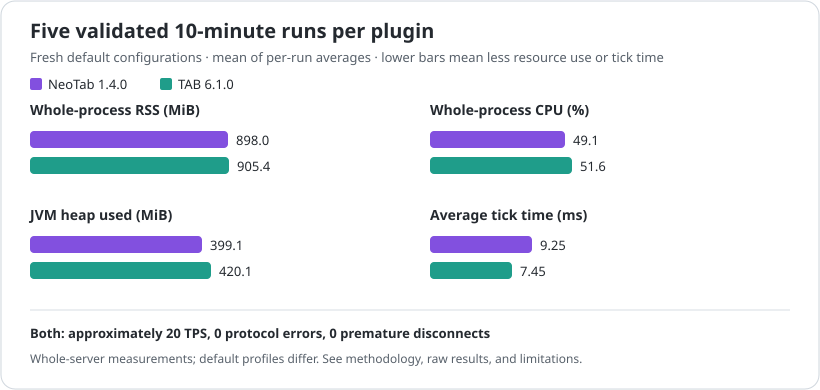

# NeoTab

NeoTab is a lightweight Paper, Spigot, and CraftBukkit tablist plugin for Minecraft `1.20.6+` that adds an animated tablist header and a live footer with RAM and ping stats.

Modrinth: https://modrinth.com/plugin/neotab/versions

Discord: https://discord.gg/pjM6ztnzMR

[Performance and stability benchmarks are documented separately with methodology, raw results and limitations.](docs/benchmarks/README.md)

[](docs/benchmarks/tab-vs-neotab/README.md)

_This is a default-configuration comparison, not a perfectly feature-matched microbenchmark._

## Versions

| Version | Type | Minecraft | Notes |
| --- | --- | --- | --- |
| `1.0.2` | Stable | `1.21.11`, `26.1.x` | Original public release. Animated header, RAM footer, ping stats, LuckPerms prefix/suffix support. |
| `1.1.0` | Stable | `1.20.6+` target, tested with `1.20.6`, `1.21.x` and `26.1.x` | Adds optional PlaceholderAPI support, Modrinth update checks, and in-game performance presets. |
| `1.1.1` | Patch | `1.20.6+` target, tested with `1.20.6`, `1.21.x`, `26.1.x` and Paper `26.2` beta | Adds ingame header color presets, custom color lists, and improves LuckPerms name color handling. |
| `1.2.0` | Stable | `1.20.6+` target, tested with Paper `26.1.2` | Expands the GUI with direct color controls, scoreboard line presets, deletable scoreboard presets, separate tab/scoreboard intervals, animated scoreboard titles, and configurable ActionBar Timer text. |
| `1.3.0` | Stable | `1.20.6+` target | ActionBar Extras, Region Profiles, Random Messages management commands, safer scoreboard interop, global ActionBar disable fixes, and Paper `1.20.6` compile-target protection. |
| `1.3.1` | Stable patch | `1.20.6+` target | Fixes a delayed scoreboard join race, makes equal-priority ActionBar selection deterministic, and hides unauthorized ActionBar tab completions. |
| `1.3.2` | Stable patch | `1.20.6+` target | Hardens lifecycle and permission checks, improves tab/scoreboard coexistence, spatially indexes expensive lookups, modernizes Paper APIs, and moves YAML disk writes off the server thread. |
| `1.3.3` | Stable patch | `1.20.6+` target | Re-evaluates temporary external scoreboard ownership during normal ticks so NeoTab resumes automatically after another sidebar plugin releases control. |
| `1.4.0` | Stable | `1.20.6+` target | Adds one shared JAR for Paper, Spigot, and CraftBukkit, bStats metrics, English/German runtime localization, cross-platform animation fixes, and extensive runtime/performance hardening. |
| `1.4.1` | Stable patch | `1.20.6+` target | Adds complete German localization, makes metrics reloadable, hardens ActionBar durations against system-clock changes, and improves Linux build compatibility. |
| `1.3.0-Beta.2` | Beta | `1.20.6+` target | Region Profile GUI, Region Profiles, Random Messages management commands, expanded English defaults, inactive German message pack, and ActionBar Extras fixes. |
| `1.3.0-Beta.1` | Beta | `1.20.6+` target | ActionBar Extras: central ActionBar priority handling, stopwatch, clock, welcome, random messages, biome popup, achievements, and performance-notice modules. |

Version docs:

- [NeoTab 1.0.2](docs/1.0.2.md)
- [NeoTab 1.1.0](docs/1.1.0.md)
- [NeoTab 1.2.0](docs/1.2.0.md)
- [NeoTab 1.3.0](docs/1.3.0.md)
- [NeoTab 1.3.1](docs/1.3.1.md)
- [NeoTab 1.3.2](docs/1.3.2.md)
- [NeoTab 1.3.3](docs/1.3.3.md)
- [NeoTab 1.4.0](docs/1.4.0.md)
- [NeoTab 1.4.1](docs/1.4.1.md)

## Features

- Animated tab header styles: `rainbow`, `purple-pulse`, `gradient-wave`, `static`
- Live footer stats for RAM usage and ping
- Optional LuckPerms prefix/suffix support in player list names
- Optional PlaceholderAPI support in `server-name` and `ram-format` (`1.1.0-Beta.1+`)
- Optional Modrinth update checker with admin notifications
- In-game performance presets for tab update intervals
- In-game header color presets and custom color lists
- Ingame control panel with `/tab gui`
- Direct GUI color controls for `purple`, `red`, `green`, `gold`, and custom hex colors
- Per-player sidebar scoreboard controls with editable lines, line presets, named presets, and deletable presets
- Separate update intervals for tab and scoreboard rendering
- Optional animated scoreboard title using the same animation styles as the tab header
- Configurable ActionBar Timer text with `{time}` and `timer ends` completion text
- Central ActionBar priority system for timer, stopwatch, popups, clock, random messages, and other Extras modules
- ActionBar Stopwatch, Clock, Welcome message, Random Messages, Biome Popup, Achievements, and Nearest Player modules
- Region Profiles for automatic tab and scoreboard profile switching inside configured cuboid regions
- English (default) and German localization for commands, GUI, ActionBar defaults, and NeoTab console output
- Shared active color palette for tab, scoreboard, chat messages, and timer output
- Spigot `1.20.6` API compile target with Java 21 bytecode and a shared Paper/Spigot/CraftBukkit JAR

## Installation

1. Download the JAR from Modrinth or GitHub Releases.
2. Put the JAR into your Paper, Spigot, or CraftBukkit server's `plugins` folder.
3. Restart the server.
4. Edit `plugins/NeoTab/config.yml`.
5. Use `/tab reload` after config changes.

## Language

NeoTab uses English by default and supports German. The selected language is saved in `plugins/NeoTab/config.yml` and applies to command messages, all NeoTab GUIs, built-in ActionBar defaults, and NeoTab console output.

```yaml
language: "en" # en/english or de/german/deutsch
```

```text
/tab language english
/tab language german
/tab lang de
```

The main `/tab gui` menu contains a language button as well. The `neotab.language` permission is required. Translations can be edited in `plugins/NeoTab/messages.yml` (English) and `plugins/NeoTab/messages_de.yml` (German); custom ActionBar/config text remains unchanged when switching languages. Upgraded configurations that explicitly enabled the old `inactive-message-packs.german` list continue to use that list as a legacy override.

## Build

```powershell
./gradlew build
```

Output:

```text
build/libs/NeoTab-1.4.1.jar
```

## Anonymous Metrics

NeoTab includes optional anonymous usage statistics powered by bStats under the registered NeoTab plugin ID `32846`. Metrics only run when `metrics.enabled` is `true`; changing the setting takes effect with `/tab reload`. bStats can also be disabled globally in `plugins/bStats/config.yml`.

NeoTab-specific charts report only these normalized or boolean values:

- configured language: `de`, `en`, or `other`
- whether the scoreboard, header, footer, RAM display, player ping display, average ping display, AFK feature, and update checker are enabled
- whether LuckPerms, PlaceholderAPI, and Geyser are installed
- normalized server platform: Paper, Spigot, CraftBukkit, or other
- the number of configured animated header/scoreboard slots grouped as `none`, `1-5`, `6-10`, or `11_plus`

The normal server count, player count, Minecraft version, NeoTab version, Java version, operating system, and server software values are handled automatically by bStats and are not duplicated as custom charts.

NeoTab does not collect player names or UUIDs, IP addresses, ports, chat messages, permissions or groups, tab/header/footer or scoreboard contents, server names, MOTDs, world names, file paths, config contents, secrets, tokens, or webhooks.

```yaml
metrics:
  enabled: true
```

## PlaceholderAPI

PlaceholderAPI support is available in `1.1.0` and newer.

If PlaceholderAPI is installed, NeoTab resolves placeholders inside:

- `server-name`
- `ram-format`

Example:

```yaml
server-name: "<gradient:#AA00AA:#BA55D3>NeoTab PAPI Test: %player_name%</gradient>"
ram-format: "<gray>PAPI: <light_purple>%player_name%</light_purple> | RAM: <light_purple>{used}MB / {total}MB</light_purple> | Ping: {playerPing}ms</gray>"
```

## Update Checker

NeoTab can check Modrinth for newer compatible versions on startup. It does not download or install updates.

```yaml
update-checker:
  enabled: true
  include-beta: false
  notify-admins: true
  check-delay-seconds: 5
```

Players with `neotab.update.notify` receive update messages when `notify-admins` is enabled.

`include-beta: false` only considers Modrinth release versions. Set it to `true` to include beta versions.

## Performance Presets

NeoTab's tab update interval can be changed in-game:

```text
/tab performance smooth
/tab performance balanced
/tab performance light
/tab performance custom 10
/tab performance save event
```

Default preset values:

```yaml
performance:
  active-preset: "smooth"
  presets:
    smooth: 3
    balanced: 10
    light: 20
  saved-presets: {}
update-interval-ticks: 3
```

Every `/tab performance ...` change is saved to `config.yml`. `save [name]` stores the current interval under `performance.saved-presets` and makes it usable again with `/tab performance [name]`.

Players need `neotab.performance` to change these settings.

## Header Colors

Change the animated header colors in-game:

```text
/tab color purple
/tab color red
/tab color green
/tab color gold
/tab color #AA00AA,#BA55D3,#DDA0DD
```

Custom color lists accept 1-5 hex colors separated by commas. The command saves the colors to `custom-colors` in `config.yml` and applies them live.

Players need `neotab.color` to change header colors.

## Control Panel

Open the ingame control panel with:

```text
/tab gui
```

The GUI has three categories:

- `Tab`: change the tab name, select animation styles, and set color presets or custom hex colors.
- `Scoreboard`: toggle the sidebar, edit lines 1-15, pick line presets, save/load/delete presets, and set the scoreboard title animation.
- `Extras`: set tab and scoreboard update intervals independently and open ActionBar Extras.
- `Language`: switch between English and German.
- `ActionBar`: control Timer, Stopwatch, Clock, Welcome, Random Messages, Biome Popup, Achievements, and Performance Notice modules.

GUI items cannot be taken or moved.

## Scoreboard

Basic commands:

```text
/tab sb on
/tab sb off
/tab sb toggle
/tab sb title <text>
/tab sb style <off|rainbow|purple-pulse|gradient-wave|static>
/tab sb interval <smooth|balanced|light|custom ticks>
/tab sb line <1-15> <text>
/tab sb clear <1-15>
/tab sb clearall
/tab sb save <name>
/tab sb load <name>
/tab sb delete <name>
/tab sb list
```

The GUI can also edit scoreboard lines through presets:

- online players
- player name
- ping
- RAM
- custom text
- clear line

Named scoreboard presets can be saved, loaded, and deleted from the GUI or commands.

Supported built-in placeholders:

```text
{online}
{max}
{ping}
{avg_ping}
{ram_used}
{ram_max}
{ram_percent}
{server_name}
{player}
{player_name}
```

PlaceholderAPI remains optional and is only used when installed and enabled.

## ActionBar Timer

```text
/tab timer start <duration>
/tab timer stop
/tab timer pause
/tab timer resume
/tab timer text <text with {time}>
/tab stopwatch start
/tab stopwatch stop
/tab stopwatch pause
/tab stopwatch resume
/tab stopwatch reset
/tab clock on
/tab clock off
/tab clock timezone <zone>
/tab clock format <format>
/tab welcome on|off
/tab randommessages on|off
/tab randommessages list
/tab randommessages add <message>
/tab randommessages remove <index>
/tab randommessages clear
/tab biomepopup on|off
/tab nearestplayer on|off
/tab achievements on|off
```

Duration examples: `30s`, `5m`, `10m`, `1h`.

The GUI includes fixed 5 minute and 10 minute starts plus a custom duration chat input. The running timer text is configurable and defaults to only showing `{time}`. When the countdown finishes, NeoTab shows `timer ends`.

NeoTab `1.3.0` routes ActionBar output through a priority dispatcher so modules do not randomly overwrite each other. Timer and Stopwatch use priority `100`, Biome Popup uses `90`, Structure Popup is reserved at `85`, Welcome uses `70`, Nearest Player uses `50`, Achievements uses `40`, Clock uses `30`, and Random Messages use `10`.

Random Messages can also be managed in-game:

```text
/tab randommessages on
/tab randommessages off
/tab randommessages list
/tab randommessages add <message>
/tab randommessages remove <index>
/tab randommessages clear
```

The default config ships with an active English message list. When the configured random-message list still matches NeoTab's defaults, switching to German selects the translated default list automatically; custom lists remain unchanged.

Structure Popup is intentionally a config/GUI placeholder in this release. Full structure detection is planned, but no heavy or unsafe structure lookup runs yet.

## Region Profiles

Region Profiles can switch a player's tab and scoreboard profile when they enter a configured cuboid. Regions live in `plugins/NeoTab/regions.yml`; the highest-priority matching region wins, and `default` uses the normal global tab and scoreboard config.

```text
/tab region wand
/tab region create <name>
/tab region delete <name>
/tab region list
/tab region info <name>
/tab region pos1 <name>
/tab region pos2 <name>
/tab region priority <name> <priority>
/tab region tab <name> <tabProfile>
/tab region scoreboard <name> <scoreboardProfile>
/tab region importselection <name>
/tab region gui
```

The region wand does not require WorldEdit. If WorldEdit or FastAsyncWorldEdit is installed, `importselection` and the region GUI can import the player's current selection.

## Header Bold

Animated headers are no longer forced bold. To restore the old bold animation style:

```yaml
header:
  bold-animation: true
```

## Notes

- PlaceholderAPI is optional and loaded via `softdepend`.
- LuckPerms is optional and loaded via `softdepend`.
- The update checker uses Modrinth's public API and a NeoTab User-Agent.
- The current source version is `1.4.1`.
- CraftBukkit ActionBar output uses a narrow runtime bridge because the Bukkit API has no public ActionBar method. NeoTab falls back to the vanilla `title` command if that bridge changes in a future Minecraft release.
- Interactive MiniMessage click/hover events are not preserved at legacy Bukkit output boundaries; RGB colors, gradients, and normal text decorations are preserved.
